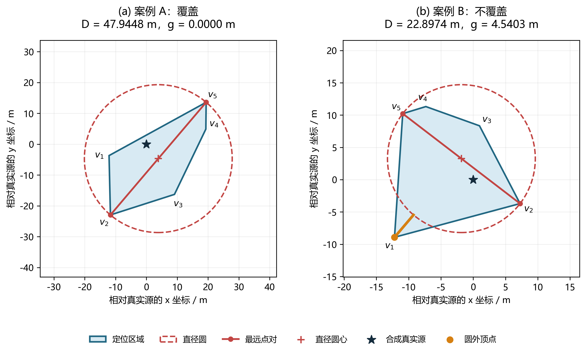
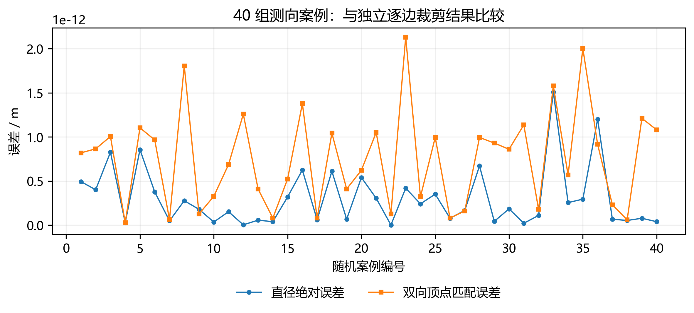
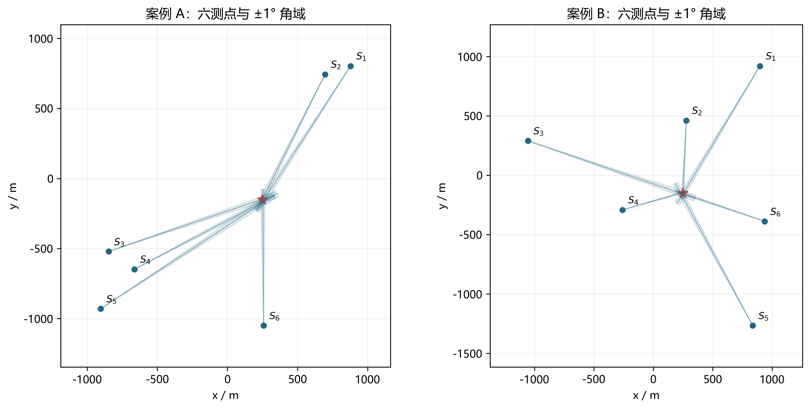

# Q1 结果验证与可视化

## 验证数据与实验设置

题目未提供问题一的固定数值观测数据，本文采用满足示向误差约束的合成数据进行验证。设干扰源真实位置为 $G$、检测点为 $S_i$，由真实方位叠加误差构造示向度：

$$
\hat\theta_i=\operatorname{atan2}(G_y-S_{iy},G_x-S_{ix})+e_i,\qquad |e_i|\le 1^\circ.
$$

上式方位角统一换算为度并按 $360^\circ$ 归一化。真实源仅用于核验；定位算法输入为检测点坐标、示向度及统一误差界。定位区域取全部前向角域的交集，不额外裁入目标圆或接收圆。几何比较容差取 $\varepsilon=10^{-7}$ m。

对于得到的顶点集 $V$，记最远点对为 $a,b$，区域直径为 $D=\|a-b\|$，直径圆心为 $o=(a+b)/2$，定义覆盖差值

$$
g=\max_{v\in V}\|v-o\|-\frac D2.
$$

计算中以 $g\le\varepsilon$ 判定覆盖。该判据具有几何依据：圆盘为凸集，包含全部顶点等价于包含其凸包，即整个定位多边形。

## 解析结果及随机交叉验证

首先采用可解析的几何区域检验直径与覆盖计算。对于顶点为 $(0,0),(4,0),(4,3),(0,3)$ 的矩形，程序得到直径 $5$ m，直径圆覆盖全部区域；对于边长为 $2$ m 的等边三角形，程序得到直径 $2$ m，而第三顶点到对应边中点的距离为 $\sqrt3$ m，大于圆半径 $1$ m，因此判定不覆盖。两项结果均与解析值一致。这两个案例用于检验几何子程序，多测点角域构造另由下述合成测向案例验证。

进一步采用固定随机种子 20260910 生成 40 组三测点观测。真实源在 $[-500,500]^2$ m 内均匀采样；检测点沿相对于真实源的 $0^\circ,120^\circ,240^\circ$ 三个方向布设，距离在 $[100,900]$ m 内均匀采样，示向误差在 $[-1^\circ,1^\circ]$ 内均匀采样。该随机分布仅为验证设置，不代表题目中的误差分布假设。

以独立实现的逐边多边形裁剪算法作为参照，比较所得直径与顶点集。参照算法从 $[-10000,10000]^2$ m 的方框开始裁剪，并逐例确认最终顶点均严格位于框内，故该方框不改变参照区域。主算法不使用此方框。顶点误差采用两集合间双向最近邻距离的最大值，以避免顶点编号不同的影响。两实现共用角域到半平面的转换，故该比较检验求交与直径计算；已知真源的约束核验补充检查模型一致性。

40 组案例均得到有界区域，且全部保留真实源。最大直径绝对差为 **1.509903e-12 m**，最大双向顶点匹配误差为 **2.132386e-12 m**，均小于预设交叉验证阈值 $10^{-6}$ m。误差分布见图 V2。

## 多检测点典型案例

选取两组各含六个检测点的合成观测，真实源均设为 $(250,-150)$ m，分别展示直径圆覆盖与不覆盖的情况。依据文件中保存的坐标与示向度重新核算实际角误差，以计入数据的小数舍入影响，两组误差均满足 ±1° 约束。检测点布局见补充图 V3，局部定位结果见图 V1。

表 V1 六测点定位区域与直径圆覆盖结果

| 案例 | 测点数 | 顶点数 | D / m | D/2 / m | 最大顶点距离 / m | g / m | 覆盖 |
|---|---:|---:|---:|---:|---:|---:|---|
| A | 6 | 5 | 47.9448 | 23.9724 | 23.9724 | 0.0000 | 是 |
| B | 6 | 5 | 22.8974 | 11.4487 | 15.9890 | 4.5403 | 否 |

注：表中长度保留四位小数，案例 A 的覆盖差值在数值容差内为零；完整未舍入结果见配套数据文件。

图 V1 六测点定位区域及直径圆覆盖判定。左右分别为覆盖与不覆盖案例；坐标以合成真实源为原点作平移，单位为米，两图均采用等比例坐标轴，但显示范围不同。浅蓝色为定位区域，红色实线为最远点对连线，红色虚线为直径圆，星号为合成真实源，橙色点为圆外顶点。

案例 A 的全部顶点均在直径圆内或圆上，因此该圆覆盖整个定位区域。案例 B 的最大顶点距离超过圆半径 4.5403 m，因而不能覆盖。该六测点反例说明，区域直径描述任意两点间的最大距离，却不能单独保证半径为 $D/2$ 的圆覆盖整个区域，必须进一步检查顶点覆盖条件。若存在任意半径为 $D/2$ 的覆盖圆，它必须同时包含相距 $D$ 的端点 $a,b$，其圆心只能为二者中点，故本反例也排除了通过更换圆心实现同半径覆盖的可能。

解析案例与随机交叉验证支持算法在上述测试范围及数值容差下的正确性。有限样本验证不能替代一般性数学证明，也不构成对任意病态浮点输入的精确认证。

## 补充验证图

图 V2 40 组随机测向案例的直径与顶点匹配误差。

图 V3 两组六测点合成案例的全局布局。蓝色点为检测点，细线为示向方向，浅色扇形为 ±1° 角域在示意长度内的显示，星号为真实源；扇形显示长度不作为定位约束。
