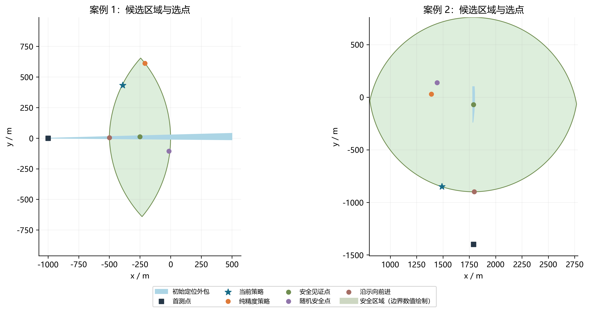
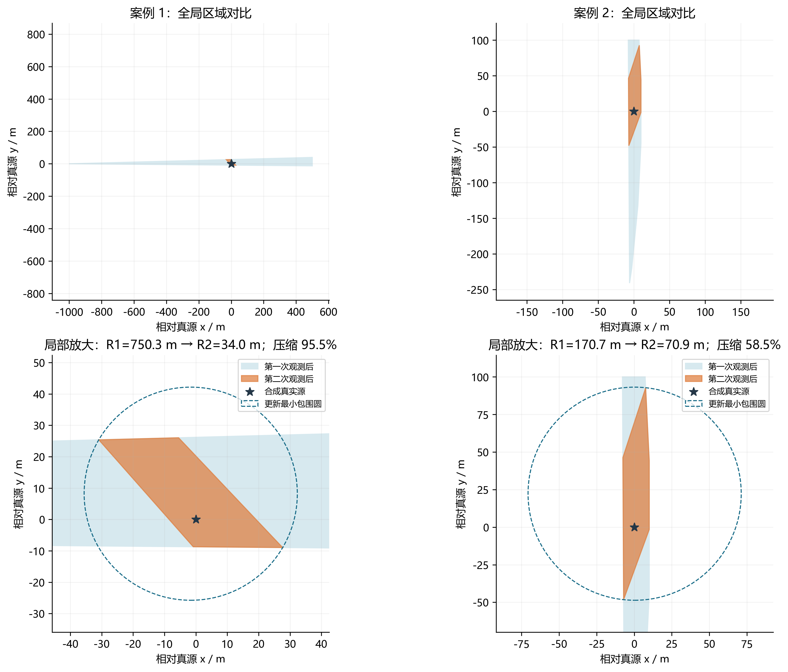
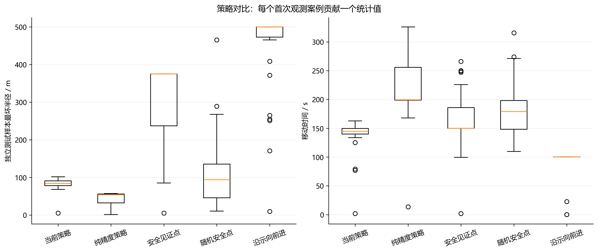
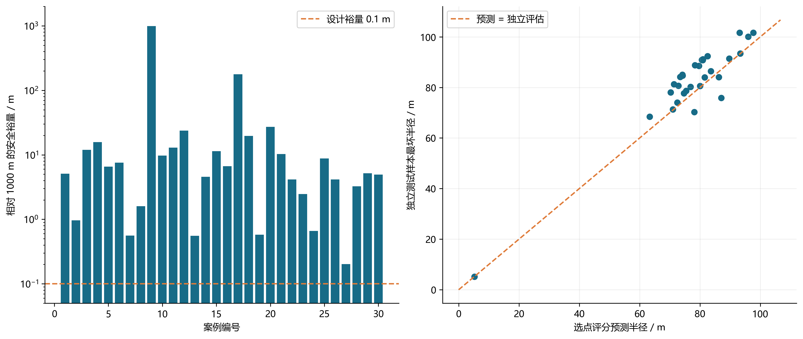
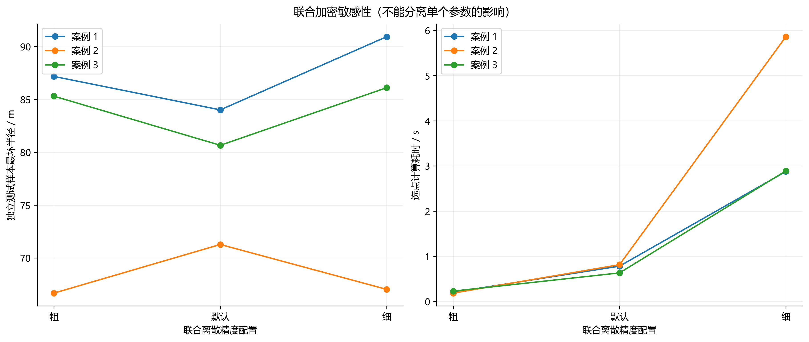
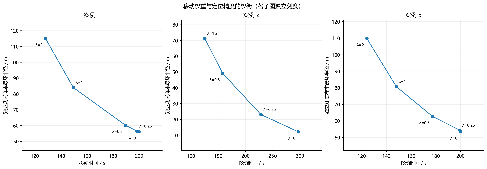

# Q2 结果验证

本文件及六组 PNG / SVG / PDF 图由 validation.py 自动生成。

本轮 30 个合成首次观测案例，每例独立源位置见 metrics.json，第二误差使用 21 个等距取值。
随机安全基线每案例独立抽取一个点。所有策略共享验证场景；真实源仅用于验证，未传给选点算法。

|策略|案例最坏半径中位数 / m|P90 / m|移动时间中位数 / s|
|---|---:|---:|---:|
|当前策略|84.088|94.083|144.872|
|纯精度策略|53.838|56.578|199.348|
|安全见证点|375.115|375.129|150.048|
|随机安全点|93.892|240.690|178.928|
|沿示向前进|499.734|499.767|100.200|

## 正确性与可靠性

- 首次观测案例数：30
- 当前策略失败数：0
- 当前策略超时数：0
- 安全裕量小于0.1m次数_容差1e-7：0
- 真源约束违规次数_容差1e-6：0
- 独立几何交叉检查次数：264
- 最大包围半径计算差_m：5.575628847509506e-10
- 最大顶点集合差_m：6.982526577477306e-10
- 计算耗时中位数_s：0.7079000499999211
- 计算耗时P95_s：0.8981994499998904
- 计算耗时最大值_s：0.9426731999999447
- 独立最坏半径超过预测的案例数_容差1e-6：26
- 独立最坏半径减预测的最大差_m：10.897654498015754

## 解释范围

- 独立评估中有 26 个案例的样本最坏半径超过评分预测，最大差 10.898 m。源场景和误差采样同时变化，本实验不能单独归因于某一项。
- 这是离线合成实验，不是官方模拟器成绩，也不是连续最坏情形或全局最优证明。
- 每案例的最坏值只覆盖本次独立源样本与误差网格。21点误差网格仍非连续枚举。
- near 单列；无线电几何半径留空，不记为零。半径≤20m比例仅以方向反馈样本为分母。
- 几何验证独立生成第二角域并枚举边界交点，独立枚举支撑圆；初始外包仍来自被测算法，因此不是整个链路完全独立。
- 敏感性图为联合参数加密，使用前3个案例；权重图同样使用前3个案例，不能代表总体最优权重。
- 安全区域边界通过等值线可视化，收信验证直接检查所有外包顶点。
- 本程序未覆盖所有失败分支、硬时限测试、独立初始几何复核或连续高精度优化参考；完整计划中的这些项目仍需另行开展。
- 不能仅凭一次初始区域到更新区域的半径下降判定策略优于基线，请结合策略对照表。

## 检验图

### 图1 候选区域与第二测点

绿色区域为保守安全候选区域，蓝色为初始定位外包。两个案例分别展示普通与目标圆边界附近的情况。

[SVG 矢量图](q2_01_candidate_region.svg) · [PDF 矢量图](q2_01_candidate_region.pdf)

### 图2 第二次检测前后定位区域

上排为全局视图，下排为局部放大。展示使用生成首次观测的真源，第二示向误差固定为 +0.37°；不是独立测试的最坏场景。

[SVG 矢量图](q2_02_before_after.svg) · [PDF 矢量图](q2_02_before_after.pdf)

### 图3 五种策略的定位效果与移动时间

每个首次观测案例贡献一个样本最坏半径和一个移动时间。箱体为四分位区间，横线为中位数，须线取1.5倍四分位距范围内的数据，圆点为其外样本。

[SVG 矢量图](q2_03_strategy_comparison.svg) · [PDF 矢量图](q2_03_strategy_comparison.pdf)

### 图4 收信安全裕量与预测偏差

左图纵轴采用对数刻度；右图参考线上方表示独立评估值高于选点评分预测。源样本与误差网格同时变化，不能单独归因。

[SVG 矢量图](q2_04_reliability.svg) · [PDF 矢量图](q2_04_reliability.pdf)

### 图5 联合离散加密敏感性

粗、默认、细三档同时改变外包边数、网格与样本上限，完整配置保存在 metrics.json。加密后半径并非单调下降，不能据此认定数值收敛。

[SVG 矢量图](q2_05_resolution.svg) · [PDF 矢量图](q2_05_resolution.pdf)

### 图6 移动权重与定位精度权衡

λ 为移动权重，单位 m/s；三个子图使用独立刻度。相同点对应多个权重时合并标注。

[SVG 矢量图](q2_06_weight_tradeoff.svg) · [PDF 矢量图](q2_06_weight_tradeoff.pdf)

## 原始结果与复现

[策略统计表](strategy_summary.csv) · [可靠性统计表](reliability_summary.csv) · [原始结果与配置](metrics.json) · [运行说明](../VALIDATION_README.md)

