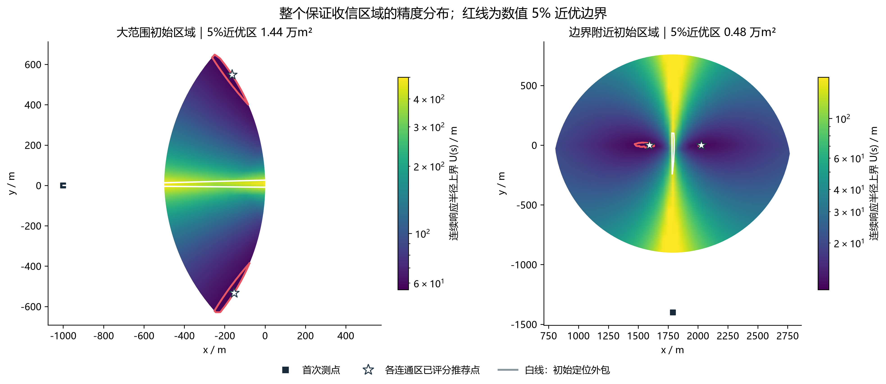
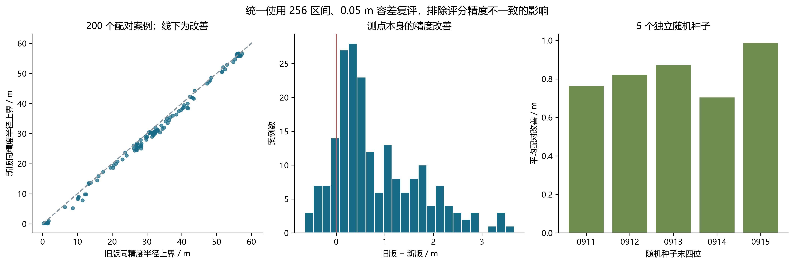
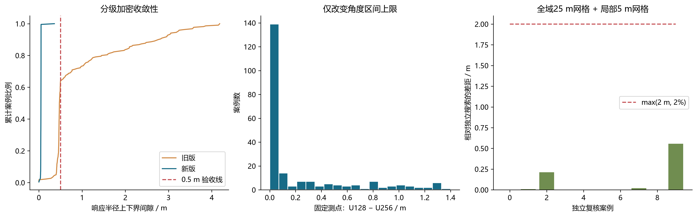
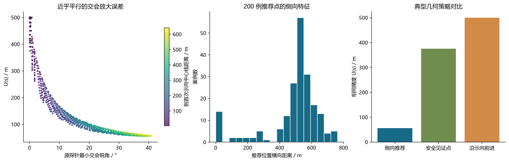
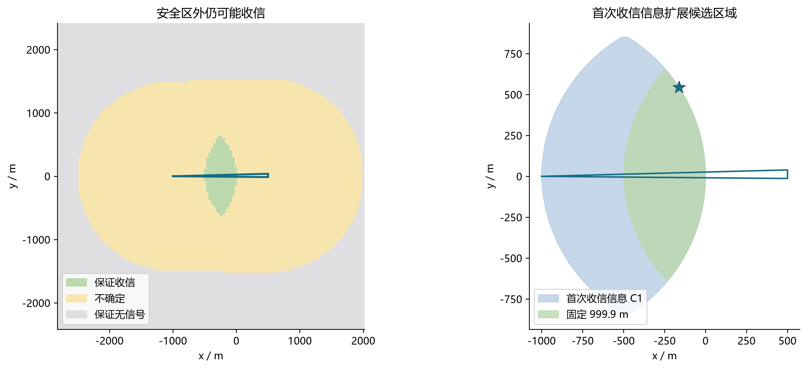
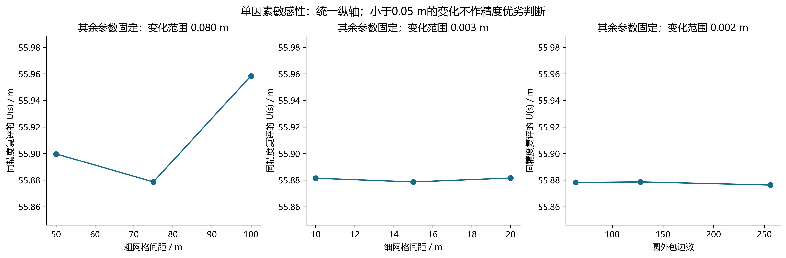

# Q2 按优化建议升级后的验证报告

所有案例均为离线合成观测，真实源只传入独立验证器，不参与选点。旧版对照位置与原始评分保存在本版paired_results.json中；目录仅保留最新版算法、文档与验收材料。重新进行配对检验时读取这些已保存位置，并统一重新评分，不再运行旧算法；旧版耗时为历史记录。

## 配对检验

200 个分层随机观测（5 个种子）及 20 个附加极限切向边界案例。实际完成 200 + 20 例。
新旧推荐位置均以同一初始外包、256 个角度区间上限、0.05 m 容差复评。此比较隔离了选点变化与上界加密的影响。

| 指标 | 结果 |
| --- | --- |
| 旧 / 新半径上界中位数 | 47.521 / 46.980 m |
| 配对改善均值 / 中位数 | 0.829 / 0.528 m |
| 平均改善的 bootstrap 95% 区间 | [0.708, 0.955] m |
| 单侧配对 Wilcoxon p 值 | 1.69e-27 |
| 改善 / 持平 / 退步（±0.05 m） | 171 / 8 / 21 |
| 最大退步 | 0.649 m |
| 旧 / 新最大上下界间隙 | 4.183 / 0.358 m |
| 旧 / 新计算时间中位数 | 1.446 / 5.031 s |
| 失败 / 收信安全违规 / 真源遗漏 / 上界违规 | 0 / 0 / 0 / 0 |
| 独立 direction 响应检验次数 | 49077 |
| 两种 MEC 实现的最大差异 | 5.41e-10 m |

逐种子平均改善：20260911: 0.762 m；20260912: 0.821 m；20260913: 0.872 m；20260914: 0.703 m；20260915: 0.985 m。

独立物理响应复核：双方均有direction统计的 193 个随机案例，采样最坏半径平均下降 0.638 m；其中 140 例改善、45 例退步，其余在±0.05 m内。near单列，未以0 m补入。该采样最坏值是独立检验，不是连续最坏情形证明。

统计区间针对这组分层合成实验，不能外推为所有场景必然改善。提高精度的代价是更多计算时间；CSV 明确保留退步案例。

## 独立搜索与稳定性

各随机种子预先按初始区域半径选取最窄、最宽各一例，共 10 例。独立执行全域25 m网格、前12名精评分及前三处5 m局部网格。通过 10/10，最大差距 0.556 m，验收阈值为 max(2 m, 参考值的2%)。

固定新版推荐点仅改变角度上限，128→256 最大半径变化 1.400 m；这是评分稳定性，未冒称位置全局最优。

## 连续候选区域与几何特征

固定保证收信区是圆盘交；5%近优区域按整个区域的 U(s) 采样构建安全三角网格并提取等值线。边界、面积、形心为数值近似；推荐点逐点评分和收信核验。网格三角形均在凸安全区内，但插值不构成每个内部点的精度证明。阈值相对于采样最小上界，不是已证明的全局最优值。

交会角图使用顶点、边中点和中心源探针，报告探针最小锐角，不能解释成连续源集上的严格最小交会角。接近0°或180°时误差放大；侧向点通常更有效，但还受源不确定范围和收信区域限制。

| 案例 | 安全区面积 m² | 5%近优区面积 m² | 连通区数 | 网格 m |
| --- | ---: | ---: | ---: | ---: |
| wide_grid_check | 439229.4 | 14380.8 | 2 | 45 |
| wide_fixed | 439229.4 | 14412.0 | 2 | 30 |
| wide_information | 1210230.1 | 18134.6 | 2 | 30 |
| narrow_fixed | 2448648.7 | 4764.5 | 2 | 40 |

连通区边界坐标、面积、形心和推荐点详见各 `*_candidate_region.json`。形心可能不在非凸近优区内，应采用已经评分的推荐点。

| 保证方案 | 推荐 U(s) m | 移动距离 m | 计算时间 s |
| --- | ---: | ---: | ---: |
| wide_fixed | 55.879 | 999.9 | 5.203 |
| wide_information | 55.879 | 1000.0 | 5.547 |

C₁ 使用第一次已经收信的信息以及同一源接收半径不变的假设。固定主方案预留0.1 m裕量；C₁按题面定义使用闭集保证，不额外预留该裕量。C₁须检查多边形顶点、边与1000 m圆交点、圆弧极值点，不能只检查顶点。

近优区域45→30 m网格复核：面积 14380.8→14412.0 m²；采样最小上界 55.910→55.910 m。面积随网格变化，未将小数精度误作空间认证。

## 指标、边界与复现

主指标为最小包围圆半径，直接对应半径20 m清除条件。CSV同时报告独立响应的最大直径、最大面积、半径压缩率、移动距离和移动时间；这些最大值可能来自不同响应。D(P)≤2R_MEC(P)，但D≤40 m不充分保证R_MEC≤20 m。near不当作0 m几何半径。

敏感性图固定其余参数且统一纵轴。细网格和圆边数引起的变化小于0.05 m评分容差，不能据此断言其中某一参数严格最优；改变圆边数还会改变初始外包集合。

初始区域退化为线段时，独立验证器保留两端约束，避免把有限线段误作无限直线；有对应点/线段回归测试。目录已清理旧版结果、旧计划和中间检查点，当前仅保留最终验收证据。

```powershell
python -m unittest discover -s B/q2/tests -v
python -m B.q2.optimization_validation --cases 200 --workers 4
python -m B.q2.optimization_validation --phase check
```

完整参数、输入、源验证样本、种子、代码哈希和结果保存在 `paired_results.json`；逐例指标见 `paired_metrics.csv`，独立搜索见 `independent_search.json`。本机并行运行的耗时用于说明计算成本，不能视为单核实时承诺。

## 可视化












