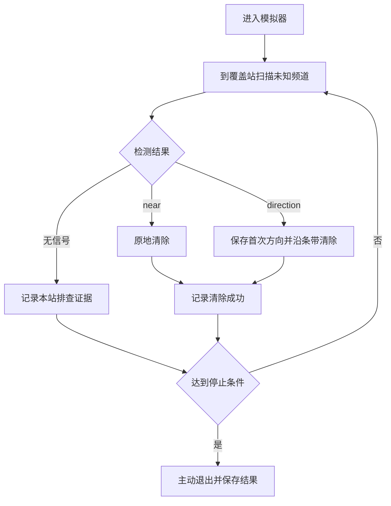

# B题无线电干扰源定位与清除建模及算法实现规范

版本：1.0。日期：2026-09-10。

本文用于指导问题1—4的程序实现、实验复核与论文撰写。核心路线为有界角误差下的集合定位、保证发现的站网覆盖、局部清除及受预算约束的主动测点优化。文档给出可以直接实现的完整基线，并将提速算法与基线的保证条件分开。

本版本已完成题面与接口规则核对、关键数学推导、站网及条带常数的独立复核和确定性计算；尚未实现完整控制程序，尚未运行官方演练或正式测试。本文任何耗时上界均非官方测试成绩。算法保证以题设成立、合法请求能执行、坐标计算满足误差裕量为条件；现实通信时限须另外验证。

## 1 阅读顺序与依据

首次实现依次阅读第2—4节、第7—10节和第12节，可先完成不依赖复杂几何优化的保证型基线B0；随后实现第5—6节和第11节的提速版本B1。第13—15节规定实验、验收与交付。

| 标识 | 原始材料 | 使用内容 |
|---|---|---|
| S1 | `CUMCM2026Problems/B题/B题.pdf`，第1—4页 | 四问、误差、物理规则、评价指标、测试要求 |
| S2 | `CUMCM2026Problems/B题/附件/附件1.docx`，第2—4节 | 模拟器操作、计时、演练与日志 |
| S3 | `CUMCM2026Problems/B题/附件/附件2.docx`，第1—12节 | 坐标、HTTP协议、状态更新与错误处理 |

上述相对路径均以项目根目录为基准，原始文件只读。实现结果使用`work/`；既有初评和方向笔记保留。发生接口理解冲突时回查S3，发生数学规则冲突时回查S1，不将探索笔记当成官方规定。

## 2 问题边界与目标

### 2.1 已知条件

- 所有源位于半径1800m的闭圆盘内；机器狗可到圆外检测或清除。
- 频道为1—20，每频道至多一个源；总源数为10—16，具体数量未知。
- 每个源的有效接收半径固定在1000—1500m之间，接口不返回该半径。
- 全向源覆盖360°；定向源覆盖发射方向两侧各90°，包含边界。
- 方向误差范围为±1°，同一地点重复检测不能消除固定误差。
- 机器狗初始位置为原点、检测频道为1；速度5m/s。
- 检测动作5s，切换检测频道1s；清除失败3s，成功5s。
- 光学清除只依赖20m距离条件，不依赖源的发射朝向。

### 2.2 可获得与不可获得的数据

可获得：本次请求目标位置、目标频道、是否接受、虚拟时间、方向/近距/无信号、清除是否成功、进入后剩余现实时间。

不可获得：源坐标、源接收半径、发射朝向、各源类型、当前剩余源数量、数值场强。不得设计依赖场强反演距离或直接读取案例真值的算法。演练结束界面给出的源总数只用于事后评估。

### 2.3 优化目标

第一层目标为完成性：所有真实源清除成功，且不在无法排除遗漏时误报完成。第二层目标为在满足完成性和预算的策略中减少总虚拟时间。第三层关注现实程序耗时与日志大小。

设路长为L，合法检测次数为N_m，频道切换数为N_s，合法清除尝试次数为N_a，成功清除数为N_c，则

\[
T=\frac L5+N_s+5N_m+3N_a+2N_c.\tag{1}
\]

N_a包含成功尝试。进入与退出不增加虚拟时间。无信号、近距检测和失败清除仍应计入相应动作数及移动。

题目平均定位清除时间为T/N_c；它不是“发现到清除的平均时延”。N_c=0时比值记为未定义，不写成0。一个固定案例全部清除时，最小化T与最小化T/N_c等价。

## 3 符号、单位与模型假设

| 符号 | 含义 | 单位或范围 |
|---|---|---|
| D | 目标闭圆盘 | `||g||≤1800`，m |
| g_c | 频道c的真实源位置 | 二维坐标，m |
| R_c | 频道c的实际有效接收半径 | [1000,1500]m |
| d_c | 定向源的发射单位向量 | 二维单位向量 |
| s_i、p | 检测位置、狗当前位置 | m |
| θ_i | 返回示向度 | 接口用度，内部统一弧度 |
| δ | 理论误差半宽 | 1° |
| δ_impl | 实现保守误差半宽 | 建议1.005° |
| W_i | 一次方向观测的前向角域 | 二维集合 |
| P | 第一问的纯角域交 | 凸集，可能空或无界 |
| A_c | 满足全部物理观测的源位置集 | 可能非凸 |
| P_c^+ | 程序维护的凸外包区域 | 包含真实可行集 |
| V、v_j | 覆盖站点集、凸多边形顶点 | m |
| (o,r) | 区域包围圆的圆心和半径 | m |
| λ | 测点目标中移动时间的权重 | m/s |
| K | 单源额外测向次数上限 | 非负整数 |

建模约定：不假定源位置或误差具有已知概率分布；硬保证使用有界集合。用于选点的均匀采样属于自行设定的近似方法。实现使用1.005°是对返回值保留两位小数的保守处理，不将其写成官方误差规定。若后续确认±1°已经包括量化误差，可评估是否恢复1°，但必须统一代码与论文。

## 4 观测模型与可行域表示

### 4.1 正向观测模型

全向源可见当且仅当`||s-g_c||≤R_c`。定向源还需满足

\[
d_c\cdot(s-g_c)\ge0.\tag{2}
\]

在可见条件下，距离≤5m返回near；否则返回direction，读数为真实方位加有界误差后归一化至[0,360)。不可见时返回no_signal。清除成功当且仅当指定频道仍存在未清除源且距离≤20m。

实现跨越0°的角差应使用`atan2(sin(a-b),cos(a-b))`，不直接比较两个角度大小。只有direction响应包含`svd_deg`。

### 4.2 方向观测对应的线性约束

令`cross(a,b)=a_x b_y-a_y b_x`，`u(θ)=(cosθ,sinθ)`，则

\[
W_i=\{x:\operatorname{cross}(u(\theta_i-\delta),x-s_i)\ge0,
\operatorname{cross}(u(\theta_i+\delta),x-s_i)\le0\}.\tag{3}
\]

统一采用`a·x≤b`存储。设`l=u(θ-δ)`、`r=u(θ+δ)`，两行约束为

```text
a_lower = ( l_y, -l_x), b_lower = dot(a_lower, s)
a_upper = (-r_y,  r_x), b_upper = dot(a_upper, s)
```

该表示包含前向性，禁止用无限直线条带代替角域。每次新增方向后，交集只能保持或缩小。

### 4.3 第一问与控制程序中的区域必须区分

第一问计算`P=∩W_i`，不任意添加目标圆或接收圆后仍称其为原定位多边形。实际控制可利用更强信息：

\[
A_c\subseteq D\cap\bigcap_{i\in I_c}\left(W_i\cap B(s_i,1500)\right).\tag{4}
\]

正常方向响应还意味着距离>5m。全向模式下no_signal可排除该测点闭1000m圆；清除失败可排除该点闭20m圆。但这些排除会形成非凸区域，基线不依靠它们收缩位置集。

### 4.4 推荐实现为凸外包多边形

控制程序维护`P_c^+`，保持不变量`g_c∈A_c⊆P_c^+`。不实施5m排除、无信号排除或清除失败排除，只存原始证据，减少非凸几何复杂度。

圆盘`B(o,R)`用M个切向半平面外包：

\[
n_k\cdot(x-o)\le R,\quad n_k=(\cos(2\pi k/M),\sin(2\pi k/M)).\tag{5}
\]

建议M=128起步。这是外切多边形，包含圆盘；禁止使用内接多边形，因为它可能排除真源。半径误差最大为`R(sec(π/M)-1)`，需要评估其对清除判据的影响，但不会损害包含性。

初始化为目标圆的外包多边形；每个方向加入两条角域约束及其1500m接收圆的外包约束。采用凸多边形逐半平面裁剪：保留边两端的内外状态，在跨界处插入线段与边界交点，然后去重。空区域意味着观测处理或数值异常，不能解释为该源不存在；回到已保存的首次方向条带执行兜底。

数值原则：位置约束法向量归一化；容差带单位。推荐初始几何容差`1e-7m`、顶点去重容差`1e-6m`，并在边界测试后确认。用于保证的约束可向外放松，不能为了得到小区域而向内缩。清除半径判据另留0.1m裕量；单纯设一个浮点epsilon并不构成数值可靠性的证明。

## 5 第一问算法规范

### 5.1 非空性与有界性

输入任意数量的方向约束，先求线性可行性。对于非空交集分别求x、-x、y、-y的最大值；任一方向无上界，则区域无界，数学上直径为无穷。序列化输出用`status=UNBOUNDED`及`diameter_m=null`表达，不向JSON写入Infinity。四个方向都有有限上界才能继续顶点计算。实现可使用线性规划求解器或独立半平面交算法，必须区分不可行、无界和数值失败。两个坐标变量均允许取任意实数，不得沿用求解器可能存在的变量非负默认约束。

不得仅枚举边界交点后默认交集有界；无界楔形也可能拥有有限个顶点。控制程序因为有目标圆外包，天然有界，但第一问的通用接口仍须保留此检查。

### 5.2 顶点、直径与覆盖判定

参考实现：枚举所有非平行约束边界的交点，保留满足全部约束的点，去重、构造凸包。对已确认有界且非空的交集，正确处理点或线段退化。

\[
D(P)=\max_{j,k}\|v_j-v_k\|.\tag{6}
\]

顶点对穷举为`O(m²)`，适合作为可信参考；需要时再用旋转卡壳提速。设最远点为a、b，圆心为`(a+b)/2`，则直径圆覆盖区域当且仅当

\[
\max_j\left\|v_j-\frac{a+b}{2}\right\|\le\frac{D(P)}2.\tag{7}
\]

等边三角形反例说明一般不覆盖。等价判据为所有顶点满足`(v_j-a)·(v_j-b)≤0`。

输出字段：`status`、`vertices`、`diameter_m`、`diameter_pair`、`diameter_circle_covers`。空集或无界时不能伪造直径圆；对应字段为null。

### 5.3 包围圆与安全清除

求

\[
\min_{o,r}r,\quad\|v_j-o\|\le r\quad\forall j.\tag{8}
\]

圆盘为凸集，包含所有顶点即可包含整个凸多边形。可用经过验证的最小包围圆算法；小规模参考实现枚举单点圆心、点对中点及非共线三点外心，对每个候选圆心计算所有顶点最大距离，取最小值。参考实现最坏约`O(m⁴)`，只用于小规模验证；生产实现可用固定种子的随机增量法。

不依赖算法返回的半径数值，最终重新计算`r_cover=max_j||v_j-o||`，加上明确的误差裕量再决策。仅当`r_cover≤19.9m`且外包几何通过检查时，调用`clear(o,c)`。未得到最小圆但得到有效覆盖圆时，仍可用于安全清除，只是可能较保守。禁止用多边形质心加`D/2`替代覆盖检查。

## 6 第二问主动测点算法

### 6.1 保证再次收信的候选区域

对全向源，保守安全候选区域为

\[
C_0(A)=\bigcap_{g\in A}B(g,1000).\tag{9}
\]

选点位于其中即可保证可接收，近距情况返回near。程序用凸外包顶点实现更保守但可验证的条件：

\[
C_{safe}=\{s:\max_{v\in\operatorname{vert}(P_c^+)}\|s-v\|\le1000\}.\tag{10}
\]

距离函数的凸性保证最大值可在顶点取到。建议使用999.9m作数值筛选阈值。该集合可能为空；这表示保守规则无候选，不表示实际无法继续搜索。

更精细的模型可利用首次收信推出的`R_c≥max(1000,||g-s_1||)`，得到

\[
C_1(A)=\{s:\|s-g\|\le\max(1000,\|g-s_1\|),\ \forall g\in A\}.\tag{11}
\]

式(11)是扩展方案；不允许仅在有限源样本上成立便标记为连续域安全。初版实现使用式(10)。第四问未知朝向时不能使用式(10)宣称可接收。

### 6.2 有限候选生成与评价

建议确定性参数：粗测点间距100m，细化间距20m；最多保留24个候选、32个源场景，误差场景取`{-δ_impl,0,+δ_impl}`；λ初值1m/s。这些是待调参数，不是已证最优值。

候选生成：在任一外包顶点的1000m圆包围盒内铺粗网格，过滤式(10)，按到当前位置的距离截取候选，并保留外包区域中心附近的代表点；对最优粗候选邻域细化。排除已在同一频道检测过的位置，避免原地重复固定误差。安全集合有候选但网格没有采到时，可细化一次；仍为空则返回`NO_CANDIDATE`，不进入无限循环。

源场景可取真实物理外包内的网格点和边界代表点；明确保存生成方法。对每个候选s和场景g，若`||s-g||≤5`，按near处理，后续定位半径记0；否则枚举误差e并构造模拟方向

\[
\widehat\theta=\operatorname{atan2}(g_y-s_y,g_x-s_x)+e.
\]

使用同一几何模块计算模拟更新区域的包围圆半径，得到

\[
\widehat J(s)=\max_{g,e}\widehat r(P_c^+\cap W(s,\widehat\theta))
+\lambda\frac{\|s-p\|}{5}.\tag{12}
\]

这里的帽号表示离散近似。模拟更新也可加入该测点1500m圆外包以与实际一致。加入属于外包但不满足真实圆约束的额外场景，可能抬高离散目标；然而有限源样本与误差样本整体仍不能提供连续最坏值上界。须在实验元数据中说明场景生成范围。

输出最优候选及满足`J≤J_min+ε`的候选点云，ε单位为m，建议初值10m。不能把离散点云插值成区域后声称插值区域也满足收信保证。评价达到本轮计算时间上限立即返回当前最好候选或`NO_CANDIDATE`。

### 6.3 实际反馈与退出条件

direction：保存观测、更新外包；near：原地清除；no_signal：保留记录，基线不裁剪外包。若全向安全候选仍返回no_signal，应标记安全集合或协议一致性异常并转兜底。

连续两个有效方向更新后包围半径未明显下降、无合法候选、几何异常、测向次数用完或时间预算不足，均终止主动测向。阈值属提速参数，不影响兜底成立。

### 6.4 第四问的可选候选策略

当源类型和朝向未知时，只把成功方向加入外包。提速版可从首次示向的条带坐标生成有限点，例如纵向`{250,500,750,1000,1250}m`、横向`{-200,+200}m`，以区域压缩估计与移动代价排序后依次尝试，最多K次。no_signal分支仅消耗预算并保留原区域，不假定“朝源前进必有信号”。这是一种有兜底的启发式，不具有第二次必收信保证。

## 7 全域发现站网

### 7.1 问题3的七点站网

\[
V_3=\{(0,0)\}\cup\{1150(\cos(k\pi/3),\sin(k\pi/3)):k=0,\ldots,5\}.\tag{13}
\]

中心覆盖半径1000m以内。对于源径向距离`r∈[1000,1800]`，最近环站角差≤30°，因此站源距离平方不超过

\[
f(r)=r^2+1150^2-2\cdot1150r\cos(\pi/6).
\]

f为凸二次函数，区间最大值在端点。端点距离分别约575.014m与988.511m，均小于1000m，故七站对全部全向源保证至少发现一次。

路径为原点、k=0至5环点，末站无需回原点，站间总路长6900m。每站频道顺序可交替升序与降序；这是减少切换的启发式，时间保证不依赖具体频道顺序。

### 7.2 问题4的三角格站网

取h=990m，

\[
v_{ij}=\left(h(i+j/2),\sqrt3hj/2\right),\quad i,j\in\mathbb Z,
\]

保留`||v_ij||≤2790m`的点，共31个。确定性生成范围可以取`j=-4,...,4`、`i=-5,...,5`，再用半径条件筛选；此范围包含所有符合条件的格点，不得仅随意截取31点。

覆盖证明：无限三角格将平面划分为边长h的等边三角形。任意目标g属于其中一个闭三角形，距三个顶点均≤h；三个顶点距原点均≤`1800+h`，故均被保留。若发射半平面不包含任何顶点，则三个顶点在其严格背面，其凸组合g也在严格背面，矛盾。因此任意发射朝向至少使一个顶点可见，距离又小于1000m，保证发现。

这只证明发现，不保证三个顶点都有信号或能形成良好交会角。圆外站点不可全部删除。若后续裁剪站点、平移或旋转格网，必须重新证明目标圆全覆盖。

### 7.3 站间路径

基线从原点开始，重复选择最近的未访问站，距离相等时按格索引`(j,i)`排序。确定性验证脚本以平方距离保留6位小数后破除浮点近似平局，生成的路径为31149.460599m。该长度并非最短路证明。

任意两站距离≤5580m，故从原点遍历其余30站的任意顺序均有站间路长上界167400m。这一粗上界用于不依赖路径优化的完成性证明。

## 8 已发现源的确定性条带清除

### 8.1 条带构造

从首次成功direction观测保存`anchor_position=s_0`、`anchor_bearing=θ_0`。令u为示向单位向量、n为其逆时针法向。真源可以写成

\[
g=s_0+tu+zn,\quad 0\le t\le1500,\quad|z|\le1500\sin\delta_{impl}<26.4.\tag{14}
\]

布置152个清除位置：

\[
q_{k,-}=s_0+20ku-15n,\quad
q_{k,+}=s_0+20ku+15n,\quad k=0,\ldots,75.\tag{15}
\]

先负横向一行k递增，再正横向一行k递减。任何真源到最近行的横向距离≤15m，到最近纵向格点的距离≤10m，故距最近清除点≤`√325≈18.028m<20m`。

此保证对全向和定向源均成立，不需要后续测向。执行每个点的`/clear`直至success后立即停止。near不进入条带，原地清除即可。

### 8.2 单源时间上界及适用条件

从首次检测站出发，完整两行蛇形并返回该站的几何总长为

\[
15+1500+30+1500+15=3060\text{m}.
\]

最晚在第152点清除，动作时间≤`151×3+5=458s`，移动时间≤612s，合计≤1070s。

提前成功后直接返回站点的距离不超过未走完路线长度，故上界仍成立。实际不发送独立返回指令：下一次测量会隐式移动；若直接前往下个站，三角不等式保证实际路长不超过“先返回再前往”的计费路径。

1070s不包含首次发现检测、主动测向的额外移动和动作。它直接适用于B0从首次检测站立即进入条带的流程；若B1先走到其他测点，必须另外核算额外路线，不能继续套用同一总上界。

若152点全部合法执行仍未success，题设、角度处理或状态至少一项不一致。报告`MODEL_OR_PROTOCOL_INCONSISTENCY`，保留证据，不标记已清除、不重复无限扫描。

## 9 完整保证型基线B0

### 9.1 状态和不变量

每频道状态为`UNKNOWN`、`DETECTED`、`CLEARED`或`ABSENT`。每站每频道保存`scan_done[station_id,channel]`及原始结果，站点使用离散ID而非浮点坐标作键。

- 只有合法direction或near可以把未知频道标记为已发现。
- 只有`clear_result=success`可以标记已清除。
- 只有对全部覆盖站均得到合法no_signal、且从未有成功发现证据的未知频道，才能标记不存在。
- 已发现频道不得退回未知或标记不存在。
- 同一频道只能统计一次成功清除。

全局会话另设`NOT_ENTERED`、`ACTIVE`、`EXITED`、`INTERRUPTED`，避免把接口失败与频道不存在混淆。

### 9.2 主流程伪代码



该图省略异常分支；下面伪代码与第10节的错误处理共同构成执行规范。最后一个站扫描完成后先完成不存在判定，再检查全部频道已解决。

```text
solve_B0(problem_mode, client):
    V = seven_stations() if mode==Q3 else triangular_stations()
    route = fixed_hex_route(V) if mode==Q3 else nearest_neighbor(V)
    enter_response = client.enter()
    require enter_response.accepted
    initialize robot=(0,0), tuning_channel=1, channel_states=UNKNOWN
    establish deadline from remaining_real_duration_s

    for station in route:
        for channel in alternating_channel_order(station):
            if state[channel] != UNKNOWN:
                continue
            check time budget and unresolved request state
            result = client.measure(station.position, channel)
            require accepted; update robot state and scan record once

            if result == no_signal:
                continue

            state[channel] = DETECTED
            if result == near:
                response = client.clear(station.position, channel)
                require response.clear_result == success
            else:
                save immutable first direction as anchor
                response = strip_clear(anchor, channel)
                require response.clear_result == success

            state[channel] = CLEARED
            if count(CLEARED)==16:
                exit with completion_reason=MAX_SOURCE_COUNT_REACHED

    for channel with state UNKNOWN:
        require no_signal recorded at every station
        state[channel] = ABSENT
    require all channel states in {CLEARED, ABSENT}
    exit with completion_reason=ALL_CHANNELS_RESOLVED
```

任何`require`失败都进入错误处理而不是忽略后继续。若因现实预算提前退出，结束原因标记`TIME_BUDGET_INCOMPLETE`，不能报告保证完成。清除16个时剩余UNKNOWN可保留，使用“已达源数量上界”的全局停止证据；不伪造其站点排查记录。

### 9.3 完成性论证

假设未提前清除16个。对任意真实频道，若此前未发现，就会在所有依次访问站接受扫描；覆盖定理保证某站发现。near可直接清除，direction对应的有限条带保证清除。因此在覆盖站全部扫描后，每个真实频道均已清除，剩余全站无信号的频道确实不存在。

保证依赖动作执行和预算，而非随机误差独立性、目标位置分布或启发式测点质量。

### 9.4 请求和虚拟时间上界

保守地将每次扫描都按6s计费，包含最多1s切换。16个源均按完整条带计费。计费时允许虚构回到扫描站的折线路径作为上界，但实际请求不增加返回动作。

| 项目 | 问题3 | 问题4 |
|---|---:|---:|
| 覆盖站数量 | 7 | 31 |
| 扫描检测次数上界 | 140 | 620 |
| 清除请求上界 | 2432 | 2432 |
| 含进入退出的逻辑请求上界 | 2574 | 3054 |
| 站间路径采用的界 | 6900m | 任意顺序≤167400m |
| 总虚拟时间上界 | 19340s | 54320s |

问题4若使用本次验证的最近邻路径，总虚拟时间上界为27069.892120s。上界均小于360000s；它们是B0的保守估算，不是平均性能或最优性结论。一次近距清除只需5s，被1070s的统一上界包含。

逻辑请求不包括传输重试；重试同一动作不重复虚拟计费，但增加现实耗时和可能的日志负担。即使虚拟上界成立，也不能仅凭请求数宣称20分钟内能实际完成。

## 10 官方模拟器交互契约

### 10.1 启动和结束

模拟器与程序运行在同一台电脑。默认地址`http://127.0.0.1:2026`，只监听本机回环，可在模拟器空闲时改端口。操作员联网登录，选择Q3或Q4演练模块，启动后等待界面显示接口就绪。程序只负责`enter→measure/clear→exit`，接口没有“创建测试”“登录”“重置”或“查询真值”操作。

倒计时结束开启25分钟窗口。enter成功后最长20分钟，同时受窗口剩余时间限制。以enter响应的`remaining_real_duration_s`建立本地单调时钟截止时间，扣除保守通信余量，不能固定假定1200s。预留30s主动退出余量是初始配置，须按演练延迟调整。

### 10.2 请求结构

所有请求使用POST，路径必须精确，不加尾斜线或查询参数。请求体为无BOM的UTF-8 JSON对象，`Content-Type: application/json`，不附加未声明字段。

公共字段：

```json
{
  "arena_id": "default",
  "robot_id": "<当前登录参赛队号>",
  "request_id": "<本局唯一动作编号>"
}
```

`/enter`与`/exit`只有上述字段；`/measure`和`/clear`额外包含

```json
{
  "position": {"x": 300.0, "y": 400.0},
  "channel": 1
}
```

第二个片段必须合并进公共对象，不能单独发送。频道为1—20整数；坐标有限且各分量绝对值≤2000000m。arena_id固定为default；robot_id须与登录队号逐字节一致。robot_id长度1—64 UTF-8字节，request_id长度1—128字节，均不能含控制或不可见格式字符。请求最大65536字节、嵌套≤16层、无重复键。

### 10.3 响应与状态更新

所有业务响应包含`accepted`、`real_timestamp_ms`、`virtual_time_s`。后者是浮点数，不能按整数解析。只有HTTP成功且accepted=true、响应结构完整时才应用状态更新。

| 动作 | 额外反馈 | 本地更新 |
|---|---|---|
| enter | 剩余现实时间、最大虚拟时长等 | 初始化位置和检测频道，建立预算 |
| measure | no_signal / near / direction；direction含svd_deg | 无论哪种结果，位置和检测频道均更新 |
| clear | success / no_target_in_range | 无论成功失败均更新位置；检测频道不变 |
| exit | user_exit | 会话结束，保存最终虚拟时间 |

accepted=false表示动作没生效，其`virtual_time_s=0`不得覆盖最后有效时间。接口反馈时间用于最终统计，本地公式计时用于交叉检查。实现应容许微秒累计与响应舍入造成的小差异，并记录实际容差。

### 10.4 串行执行和幂等重试

客户端只能持有一个未决动作。每个新动作分配新ID；首次发送前把ID、路径、精确JSON内容写入本地日志。网络超时、断连或响应损坏导致是否执行不明时，使用完全相同的ID、路径和内容重试。禁止生成新ID重试可能已成功的清除或检测。

```text
submit(action):
    persist pending action
    for attempt within configured retry and deadline budget:
        send identical action
        if transport failed or response incomplete or
           (HTTP==200 and accepted==true but required result fields missing/invalid):
            keep pending action; retry identically if budget allows
        else if HTTP==200 and accepted==true and schema valid:
            apply response exactly once for this action ID
            persist committed response; clear pending; return
        else:
            classify error; do not apply robot state
            resolve according to error policy
    mark session INTERRUPTED with unresolved action
    do not issue another new action or claim successful completion
```

例如HTTP 200且accepted=true却缺少measure_result，或direction缺少svd_deg，不能当作已知拒绝后跳过；动作结果仍未完整确认，保持原ID与原内容重试。正常合法动作无请求速率上限，但必须等待完整响应后才发送下一个新动作。检测的5s是虚拟时间，不在客户端sleep(5)。不同频道也不能并发测量。

### 10.5 错误策略

| 情况 | 处理 |
|---|---|
| 200且accepted=false | 配置/业务异常，保留原状态；不无限重试 |
| 400 | 修正字段或数值错误；停止当前算法自动循环并记录 |
| 404、405、413、415 | 路径、方法、大小或编码实现错误，停止并修复 |
| 409 | ID复用内容不一致或并发动作，视为客户端严重错误 |
| 429 | 保护或记录上限，保留动作状态、受截止时间约束处理，不高频重试 |
| 500或传输中断 | 是否执行未确定时保持同ID重试；重试耗尽则中断 |
| 测试前/倒计时/测试后连接失败 | 接口可能未开放；不得无界轮询或认为源不存在 |

可将单次HTTP超时初设5s、总尝试次数3次并使用短退避，但须按实际剩余时间缩短。未知字段、错误arena/robot与结构错误不占用ID，协议允许修正后复用；生产算法应在发送前验证，避免依赖这一例外。

对已知未接受动作可以停止本局或修复后继续；对执行状态未决动作不得跳过并继续新动作。主动退出只在会话仍开放且无未决动作时执行。超时或手工中止后接口关闭，不能再通过exit查询原因。

### 10.6 日志与正式测试

程序保存自己的JSONL请求/响应，用于复现；官方加密日志用于正式提交，两者不能混淆。正式测试Q3、Q4各3次，中止同样占用机会；默认只演练，正式启动由操作员在模拟器界面选择。正式日志导出后不改内容、不改文件名，文件需在2MB以内可上传。

S1/S2规定2026-09-13北京时间17:30后不能启动新测试，并建议15:30前完成正式测试；此为本地原始材料中的安排。正式前如有官方更新应重新核对。本文不执行登录、联网演练或正式测试。

## 11 提速版本B1及保证边界

### 11.1 最小可实现的提速流程

发现direction后，维护外包并尝试最多K次主动测向；每次更新后检查安全清除条件。成功立即结束该源任务，否则回到首次方向条带兜底。Q3使用第6节安全候选，Q4使用有限启发式候选。初始建议K=2，额外实际路长上限B_L=4000m/源，额外测量耗时按最多6K秒计。

额外路长预算必须包含从扫描站出发的主动阶段实际移动，以及从其终点回到首次扫描站的计费距离。每次选动作前检查“已走主动路长+本次移动+新位置到首次站距离≤B_L”。程序实际可以直接去第一个兜底点；用先返回的虚构折线计费给出上界。

若在测点附近需要移动到包围圆心清除，该段移动也计入B_L，并计入最多一次清除尝试5s。safe-clear意外失败应记录异常并兜底，不能重复无限尝试。于是每源在B0上的保守附加预算可按

\[
\Delta T_c\le B_L/5+6K+5
\]

计，前提是实际严格执行对应限额且仍保留原始条带。该界故意允许重复计费，以保证安全。B1的现实选点计算时间另设上限，不被虚拟时间预算覆盖。

### 11.2 多源共享测点与滚动路线

后续可在访问某站时补测已发现但定位差的频道，或先记录多个源再批量清除。候选动作可比较“预计缩小半径”“绕行时间”“本次能服务多少频道”等收益。但只要延后清除、改变锚点或扫描顺序，就必须单独维护站点证据与返回成本；第9节B0时间表不自动适用于新策略。

允许重排未访问站，不允许仅凭启发式删除覆盖必要站。任意时刻保留每个UNKNOWN频道的未完成站清单。实现次序应为B0通过→受限B1通过→多源调度消融，不一次性加入所有优化。

### 11.3 建议初始配置

```yaml
problem_mode: q3                 # q3或q4，由操作员与模拟器模块保持一致
strategy: baseline_b0            # 初版默认保证型基线
angle_half_width_deg: 1.005
disk_outer_sides: 128
safe_clear_radius_m: 19.9
q3_ring_radius_m: 1150
q4_grid_spacing_m: 990
strip_step_m: 20
strip_offsets_m: [-15, 15]
max_extra_measurements_per_source: 2
extra_route_budget_m_per_source: 4000
candidate_coarse_step_m: 100
candidate_fine_step_m: 20
candidate_limit: 24
source_scenario_limit: 32
move_weight_m_per_s: 1
seed: 20260910
http_timeout_s: 5
http_max_attempts: 3
exit_reserve_s: 30
```

物理常数与搜索参数分组存储。B0忽略主动测点参数；改动条带步长、横向偏移或误差半宽需重新检查覆盖证明。队号和端口通过本地运行参数提供，不写进公共配置或提交论文。

## 12 软件接口与数据结构

### 12.1 建议模块

| 文件（拟实现于`work/src/`） | 职责与主要接口 |
|---|---|
| `client.py` | 串行POST、响应校验、幂等重试；enter/measure/clear/exit |
| `state.py` | RobotState、ChannelState、ScanRecord、待定动作与提交状态 |
| `geometry.py` | angle_halfplanes、clip_polygon、classify_intersection、diameter、enclosing_circle |
| `coverage.py` | seven_stations、triangular_stations、station_route |
| `localize.py` | update_outer_region、choose_measurement、strip_points |
| `planner.py` | B0/B1流程、预算检查和停止证据 |
| `runner.py` | 读取配置、启动控制、保存结果；不自动启动正式测试 |
| `logging_io.py` | JSONL与汇总文件、参数与版本快照 |
| `offline_simulator.py` | 自建规则仿真或HTTP替身，与真实客户端接口一致 |

以上为接口设计，不表示这些模块已经存在。正式实现路径从项目根目录解析，不依赖启动时工作目录，不复制多套共用几何逻辑。

### 12.2 核心类型

```text
RobotState:
    position: (float x, float y)
    tuning_channel: int
    virtual_time_s: float
    deadline_monotonic: float
    session_status: enum
    pending_action: Action | null
    applied_request_ids: set[str]

ChannelState:
    channel: int
    status: UNKNOWN | DETECTED | CLEARED | ABSENT
    anchor: DirectionObservation | null   # 首次成功方向，不随优化覆盖
    observations: list[Observation]
    outer_polygon: list[Point] | null
    station_no_signal_ids: set[int]
    clear_request_id: str | null
    extra_route_used_m: float
    extra_measure_count: int

Action:
    request_id: str
    path: str
    payload: immutable JSON object
    serialized_body: bytes
    created_monotonic: float

Decision:
    action_kind: MEASURE | CLEAR | EXIT
    position: Point | null
    channel: int | null
    reason: str
    expected_budget: object
```

### 12.3 几何接口约定

```text
angle_halfplanes(s, theta_rad, delta_rad) -> two normalized (a,b)
classify_intersection(halfplanes) -> EMPTY | UNBOUNDED | BOUNDED | NUMERIC_ERROR
clip_polygon(vertices_ccw, a, b) -> vertices_ccw
diameter(vertices) -> (distance, endpoint_a, endpoint_b)
enclosing_circle(vertices) -> (center, verified_cover_radius, method)
safe_second_station(s, outer_vertices) -> bool
choose_measurement(channel_state, robot_state, config) -> Candidate | NO_CANDIDATE
strip_points(anchor) -> exactly 152 ordered points
```

几何函数不发HTTP请求，不修改机器人状态。规划函数输出动作，客户端执行，状态管理器仅在已确认接受后应用一次。重放日志可复原状态而不重新访问模拟器。

### 12.4 运行产物

每局单独目录，保存配置快照、程序版本、环境版本、开始结束时间、请求JSONL、响应JSONL、决策原因、最终汇总。案例编码由模拟器界面提供，可由操作员录入到本地元数据，不能加进官方请求。

建议汇总字段：`run_id, case_code, mode, strategy, seed, completion_reason, cleared_count, true_count_if_practice, clear_ratio, virtual_total_s, average_clear_time_s, real_elapsed_s, distance_m, measure_count, switch_count, clear_attempt_count, failed_clear_count, retry_count, unresolved_action_id`。

## 13 现实预算和实验设计

### 13.1 现实时间与虚拟时间分开验收

虚拟时间用式(1)及模拟器响应交叉验证；现实时间包含HTTP等待、策略计算、日志写入和重试。B0问题4逻辑请求上界为3054，必须实测整局能否在enter给出的时长内完成。单次平均响应快不等于尾部延迟可忽略。

建立现实预算预估：`剩余扫描请求上界+未清除已发现源的剩余条带点数+未知源的保守发现后清除预算`，结合演练延迟统计估计时间。估计只用于提前切换到B0、减少优化计算或有记录地退出，不能提供网络延迟无上界时的绝对实时保证。

### 13.2 离线实验分层

1. 纯几何：生成真源与合法方向误差，检查真源始终在外包内、覆盖圆有效、条带覆盖。
2. 可控案例：中心源、圆周源、最小半径、10/16源、缺失频道、方向边界及极端误差。
3. 自建模拟：按S1/S3实现相同动作接口，固定种子生成案例；同一位置与频道重复方向须固定，不能每次独立重新抽误差。
4. HTTP替身：模拟动作已执行但响应丢失、重复请求、accepted=false、409、连接关闭与现实超时。
5. 官方演练：核对实际反馈、时间、完成率和日志体积，再冻结正式版本。

离线随机误差场可以固定种子并缓存`(channel, position)`的误差；这只是测试模型，不能声称复制了官方误差场。还必须覆盖全部+δ、全部-δ和人为设置的困难几何，防止算法依赖随机幸运。

### 13.3 消融与评价

至少比较B0、B1（主动测点）、B1加路径重排。可另比较方向中心线点估计与有界集合，但不得用不保证完成的版本代替正式基线。离线采用相同案例与种子配对比较；官方案例不可重置重放，不伪称官方各策略在同一隐藏案例上比较。

报告逐案例清除比例、题目平均时间、现实时间；另记录路径、检测、切换、失败清除、重试。跨案例报告均值、中位数、P90、最大值及完整清除局数比例，并附样本数。未知正式真值时，不自行补填源总数；保存停止证据，按题目正式表格填写。

## 14 验收标准与实现里程碑

| 范围 | 必须通过的检查 |
|---|---|
| 第一问 | 空、无界、点、线段、近平行；等边三角形不被直径圆覆盖；矩形被覆盖 |
| 角度 | 359.9°跨零、±δ边界、度转弧度、前向/背向区分 |
| 外包 | 原始真源始终保留；新增约束区域不扩大；圆外切而非内接 |
| 清除判据 | 对每个顶点验证覆盖；直径≤40不能直接触发；near原地成功 |
| 覆盖站 | 七站解析证明；三角格31点生成；圆外边界站保留 |
| 条带 | 152点、最近距离界、两行顺序、首次锚点不被覆盖、提前成功停止 |
| 状态 | 无信号不等于不存在；清除失败仍移动；clear不切频道；成功只记一次 |
| 网络 | 丢失响应重试不重复计时；未决动作不跳过；HTTP与accepted均检查 |
| 停止 | 10源不能仅按数量停；16成功可停；否则全部频道有状态证据 |
| 全流程 | B0离线对抗案例全清除，真实演练验证；B1失败能有限转B0 |

里程碑M1：基线站网、条带、客户端替身和B0控制器通过；M2：官方演练闭环并核对计时；M3：几何模块和Q2候选算法通过；M4：B1消融且现实预算稳定；M5：未负责原实现者复核代码与论文数字，冻结版本后正式测试。

每次实验在`work/notes/experiment_log.md`记录配置、输入、输出、结果和限制。正式提交前，报告数字从机器生成结果读取，图表坐标、单位与表格口径一致，保存对应官方日志。

## 15 本版本验证结果与未完成事项

确定性验证脚本位于`work/experiments/b_exploration/verify_model_spec.py`，仅使用Python标准库。运行方式：

```text
python work/experiments/b_exploration/verify_model_spec.py
```

输出为`work/results/b_model_spec_checks.json`，记录运行Python版本、参数、31站最近邻路线、覆盖端点距离、条带点数及上界。脚本核验的是本文常数与构造，不是完整算法仿真；解析覆盖保证来自第7—9节证明。

本次验证得到：31个三角格站；条带152点；条带闭路线3060m；单源兜底1070s；Q3基线保守19340s；Q4任意站序保守54320s。最近邻站间路径31149.460599m，其对应B0时间上界27069.892120s。所有数值均可由上述JSON复核。

未完成事项：完整求解程序及客户端尚未编写；官方模拟器尚未连接；现实请求耗时、日志体积、主动测点的平均收益、数值几何误差预算均待实现与演练确认。不能把本规范视为已经取得100%官方清除率或已证明最短时间。

实现优先采用B0建立闭环，再逐项加入B1。任何新优化必须保留原始观测、可回退的首次条带和完整的覆盖排查证据。
